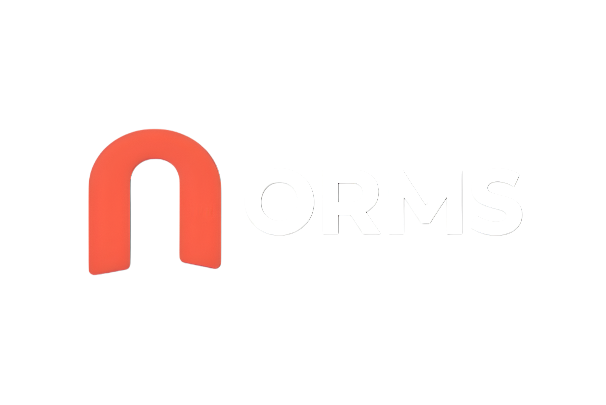

# Online Rental Management System (ORMS)

<p align="center">
  
</p>

<p align="center">
  <strong>Own less. Access more.</strong><br>
  A modern, full-stack peer-to-peer equipment and asset rental marketplace built with PHP, MySQL, and Tailwind CSS.
</p>

<p align="center">
  
  
  
  
  
  
</p>

---

## 📌 Overview

**Online Rental Management System (ORMS)** is a comprehensive peer-to-peer rental ecosystem where asset owners monetize their gear and renters easily access cameras, tools, electronics, mobility, and event equipment on demand. 

Built with enterprise-grade architecture, ORMS features strict **3NF relational database normalization**, **pessimistic concurrency locking (`SELECT ... FOR UPDATE`)** to prevent double-booking, **escrow deposit holding**, **dynamic multi-tier late fine calculations**, **neutral dispute adjudication**, and an intuitive **real-time notification system**.

---

## ✨ Key Features

### 👤 Multi-Role User Architecture
- **Dual Role Capabilities:** Users can register as **Renter**, **Owner**, or **both**, seamlessly switching operational contexts with one click.
- **Identity Verification:** Real-time ID proof verification with magic-byte MIME validation (`finfo_file`).
- **Session Security:** Strict session regeneration on authentication, bcrypt password hashing, and cookie hardening.

### 🛍️ Renter Portal
- **Catalog Discovery:** Fast search with category filtering, dynamic price sliders, and physical condition badges.
- **Live Calendar Availability:** Real-time date availability checker with concurrency protection.
- **Transparent Checkout:** Instant dynamic breakdown of total rental days, base rental fee, and refundable security deposit.
- **Escrow-Backed Payments:** Secure multi-mode payment simulation (UPI, Cards, Net Banking, Handover) with downloadable tax invoices.
- **Reviews & Ratings:** Interactive 5-star rating system with verified rental badges and duplicate submission guards.
- **Dispute Center:** Dedicated mediation workflow to resolve damage or refund disputes directly with platform administrators.

### 💼 Owner Inventory & Management
- **Equipment Ingestion:** Multi-image gallery uploader, primary photo designation, custom daily rates, and security deposit requirements.
- **Booking Workflow:** Review pending rental requests with live customer profiles, approve bookings, or decline with custom reason messages.
- **Return Inspection & Deposit Settlement:** Automated calculation of late return penalties with 2× deposit capping, damage assessment deductions, and automated net deposit refund.
- **Financial Ledger & Analytics:** Track total revenue, escrow held in custody, and completed transaction records in compliance with 3NF.

### 🛡️ Administrative Governance
- **Platform Analytics:** Real-time KPI metrics for active rentals, total volume, pending disputes, and platform users.
- **Neutral Dispute Adjudication:** Review timeline of events, inspect evidence, issue binding settlement decisions, or waive penalty charges.
- **Category Taxonomy Manager:** Manage hierarchy, categories, and foreign-key safe deletion guards.
- **Fine Rate Configuration:** Configure daily late penalty percentages and automated refund timeout windows.
- **Audit Reports:** One-click exportable audit reports across platform overviews, rental activity, earnings, and penalty histories.

### 🔔 Real-Time Notification Engine
- Event-driven notifications for rental booking updates, payment confirmations, return inspections, and dispute rulings.
- Background live polling endpoint (`poll.php`) updating navigation badge counters in real time.

---

## 🎨 Brand Identity & Design System

ORMS is crafted to match a luxury commercial SaaS aesthetic:
- **Coral (`#FF5A5F`):** Primary action buttons (`rounded-full`), active highlights, and notification accents.
- **Midnight (`#0B1020`):** High-contrast dark hero banners, navigation headers, and footer.
- **Ivory (`#FAF8F5`):** Soft, clean card backgrounds and contrast wrappers.
- **Typography:** Space Grotesk (`font-display`) for bold headings paired with Inter (`font-sans`) for clean UI readability.
- **Remix Icon CDN:** Modern, scalable SVG vector icons across all views.
- **Responsive Layout:** Adaptive drawer navigation for mobile devices and clean tabular interfaces on desktop.

---

## 🏗️ Project Architecture & Tech Stack

```
ORMS/
├── admin/                  # Platform Governance & Administration
│   ├── configure_fine_rate.php
│   ├── dashboard.php
│   ├── manage_categories.php
│   ├── manage_users.php
│   ├── reports.php
│   └── resolve_disputes.php
├── assets/                 # Brand Assets & Images
│   └── img/
│       ├── ORMS Logo.png
│       ├── ORMS Icon.png
│       └── no-image.svg
├── auth/                   # Authentication & Session Workflows
│   ├── forgot_password.php
│   ├── login.php
│   ├── logout.php
│   ├── register.php
│   ├── reset_password.php
│   └── switch_role.php
├── classes/                # Object-Oriented Domain Entities
│   ├── Admin.php
│   ├── BaseUser.php
│   ├── Dispute.php
│   ├── Fine.php
│   ├── Notification.php
│   ├── Owner.php
│   ├── Product.php
│   ├── RentalRequest.php
│   ├── Renter.php
│   ├── Review.php
│   ├── Transaction.php
│   └── exceptions/         # Domain-Specific Custom Exceptions
├── config/                 # Platform Configuration
│   ├── database.php
│   ├── fine_config.php
│   └── fine_settings.json
├── database/               # Relational Schema & Seeding
│   ├── clean_test_data.sql
│   └── orms_schema.sql
├── favicon/                # Complete multi-device favicon suite
├── includes/               # Shared Templates & Components
│   ├── footer.php
│   ├── functions.php
│   ├── header.php
│   └── navbar.php
├── notifications/          # Real-time Alerts & Polling
│   ├── poll.php
│   └── view_notifications.php
├── owner/                  # Equipment Owner Operations
│   ├── add_product.php
│   ├── dashboard.php
│   ├── delete_product.php
│   ├── earnings.php
│   ├── edit_product.php
│   ├── file_dispute.php
│   ├── manage_requests.php
│   ├── raise_fine.php
│   └── toggle_status.php
├── renter/                 # Customer & Renter Experience
│   ├── cancel_request.php
│   ├── dashboard.php
│   ├── file_dispute.php
│   ├── my_rentals.php
│   ├── pay.php
│   ├── pay_fine.php
│   ├── product_details.php
│   ├── receipt.php
│   ├── request_rental.php
│   ├── search.php
│   └── submit_review.php
├── scripts/                # Automated Background & Cron Tasks
│   ├── auto_refund_timeout.php
│   └── check_due_reminders.php
├── uploads/                # Secured File Upload Storage
│   ├── id_proofs/          # Protected User Identity Uploads (.htaccess locked)
│   └── products/           # Public Catalog Product Images
├── index.php               # Landing Homepage & Catalog Spotlight
├── LICENSE                 # MIT License
└── README.md               # Documentation
```

---

## 🔒 Security Specifications

- **Cross-Site Request Forgery (CSRF):** Cryptographically strong tokens (`bin2hex(random_bytes(32))`) validated on all mutating HTTP POST requests.
- **SQL Injection Defense:** 100% prepared PDO statements with bound parameters across all domain classes.
- **Cross-Site Scripting (XSS):** Contextual output sanitization using `htmlspecialchars($data, ENT_QUOTES, 'UTF-8')`.
- **Upload Validation:** ID proof and product photos verified using magic bytes (`finfo_open(FILEINFO_MIME_TYPE)`), rejecting spoofed file extensions.
- **Access Control & RBAC:** Strict server-side route guards enforcing role permissions (`require_role('Admin')`, `require_role('Owner')`, etc.).

---

## 🚀 Installation & Setup Guide

### Prerequisites
- **Web Server:** Apache 2.4+ (XAMPP / WampServer / LAMP)
- **PHP:** Version 8.1 or higher (PHP 8.2+ recommended)
- **Database:** MySQL 8.0+ or MariaDB 10.4+
- **PHP Extensions:** `pdo_mysql`, `fileinfo`, `gd`, `mbstring`

### Step 1: Clone Repository
```bash
git clone https://github.com/AtifZafar2843/Online-Rental-Management-System.git
```
Place the folder in your web server's root directory:
- **XAMPP (Windows):** `C:\xampp\htdocs\orms`
- **Linux:** `/var/www/html/orms`

### Step 2: Database Configuration
1. Open **phpMyAdmin** or your MySQL CLI:
```bash
mysql -u root -p
```
2. Create database and import schema:
```sql
CREATE DATABASE IF NOT EXISTS `orms` CHARACTER SET utf8mb4 COLLATE utf8mb4_unicode_ci;
USE `orms`;
SOURCE /path/to/orms/database/orms_schema.sql;
```

3. Update credentials in `config/database.php` if required:
```php
define('DB_HOST', 'localhost');
define('DB_PORT', '3306');
define('DB_NAME', 'orms');
define('DB_USER', 'root');
define('DB_PASS', '');
```

### Step 3: Configure Permissions
Ensure the upload directories are writable by the web server:
```bash
chmod -R 775 uploads/products uploads/id_proofs
```

### Step 4: Run Application
Open your browser and navigate to:
```
http://localhost/orms/
```

---

## 🔑 Default Credentials for Testing

| Role | Username / Email | Password | Access Area |
|---|---|---|---|
| **Administrator** | `admin` | `Admin@123` | `/admin/dashboard.php` |
| **Owner / Renter** | `rahul@example.com` | `Password@123` | `/owner/dashboard.php` & `/renter/dashboard.php` |
| **Renter Only** | `priya@example.com` | `Password@123` | `/renter/dashboard.php` |

---

## 📄 License

This project is licensed under the **MIT License** - see the [LICENSE](LICENSE) file for details.

---

## 👨‍💻 Author

**Atif Zafar**  
GitHub: [@AtifZafar2843](https://github.com/AtifZafar2843)
